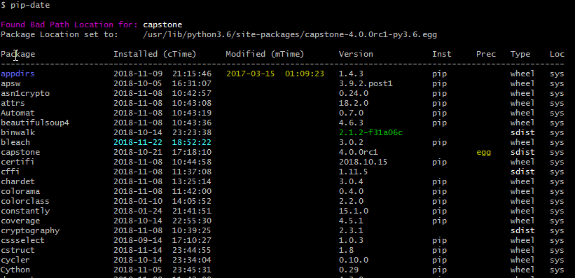
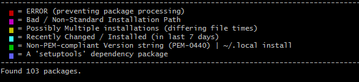

### pip-date -- Date your pip packages!

[](https://badge.fury.io/py/pip-date)
[](https://pypi.python.org/pypi/pip-date)
[](https://GitHub.com/E3V3A/pip-date/graphs/commit-activity)
[](https://github.com/E3V3A/pip-date)
[](http://isitmaintained.com//project/E3V3A/pip-date "Average time to resolve an issue")


A simple *Python3* CLI tool to show the installation or modification times of all your pip packages.

| STATUS: | Version | Date | Maintained? |
|:------- |:------- |:---- |:----------- |
| Working | `1.0.1` | 2018-11-26 | YES |

---

**Q:** *What does **`pip-date`** do?*

The primary use is for finding the *time* when a certain pip package was last modified or installed. 
It is basically using one or more of: **atime, ctime** and **mtime** from the file status (*stat*) info.
This is essentially equivalent to using the \*nix *stat* command, but is handled differently on Windows. 
(See below for further details.)

Using this information, it can show you and highlight packages that may have been corrupted or outdated. 
I also has some functionality of checking packages for outdated and deprecated installation methods. 

But it can do more. Some features are:

- Highlight packages with inconsistent file modification times (*mTime*).
- Highlight package **versions** which are not conforming to the [PEM-0440](https://www.python.org/dev/peps/pep-0440/) standard.
- Highlight packages installed with an unusual package distribution *priority* given by:  **`[chk, src, bin, egg, dev]`**
- Highlight *`setuptools`* dependency packages for easy review
- Show package installation type:  with pip/wheel as **`wheel`**, and source as **`sdist`**  (**FIX!**)
- Show package installation location:   **`usr`** for `--user` and **`sys`** for *global* installations.
- Show correct file modification time, depending on OS/FS architecture (*mtime* vs *ctime*)

**Q:** *What does it **not** do?*

- Does not install packages
- Does not show dependencies
- Does not (yet) show packages in a *`virtualenv`* or *`pipenv`* envrionment (**ToDo**)
- Does not check package consistency 
- Does not show the very first time you installed a package, if it has been updated since.  
  (Althought there are left-over artifacts that may show otherwise, we don't look for these.)


**Q:** *Why is this needed?*

It probably isn't, **BUT**...

Because python packages often rely on a large number of sub-dependencies, it is very easy to accidentally 
overwrite some required dependency of one package with a different version needed by another package. 
You will never know about it, until it breaks something. One common scenario causing package corruption 
is that you have installed some package XXX using pip, but then get an OS update and install the update 
using you OS packagemanagement system, like `apt-get install XXX`, which would probably overwrite the 
*globally* installed pip package. This is especially true for beginners of python, who has not yet learned 
how to use a virtual environment, and installing evything in either the global system (default) or 
user (`--user`) environments. This may also occur when installing packages from sources, or when 
you have to run some other non-pip installers like `setup.py`, `make install` or like, 
and you don't really know what it is going to do. 


**Q:** *What else is included?*

There is also a small script called `pipbyday` that will print a simple table with:  
`mTime/aTime` +  `package-name` + `package-version`, sorted by time.


**Q:** *Will I continue to support this tool?*

Sure, if it is broken, but I will not spend any more time for new features. So if you would like to add 
something just send me a PR, or at the very least, a detailed code snippet of what I need to implement.

---

### Dependencies

None. (Just what you already have: [Python3](https://www.python.org/) and [pip](https://github.com/pypa/pip/).)


### Installation 

There is nothing to install really. Just download the `pip-date.py` file and make sure to place it in your `PATH`.

**For pip installation:**

```bash
pip install pip-date
```


**For manual installation:**

```bash
cd /usr/bin/
wget https://github.com/E3V3A/pip-date/raw/master/pip-date
chmod 755 pip-date
```


**For developer installation:**

```bash
git clone https://github.com/E3V3A/pip-date.git
cd pip-date
pip install pip-date --user
```

---

### How to Run

```bash
pip-date      # When it's in your PATH
./pip-date    # When it's not in your PATH
```

Example Output:





---

#### DYI PyPI Packaging

For your convenience, I will show you how to make a **simple** *python-only-script* pip-installable package like this one. 
Just follow these steps. (Don't bother reading elsewhere, because 99.9% of Google's results are already outdated!)
To get started, you have to make sure you have already installed: `setuptools`, `wheel` and `twine`.

Then you need to register and get credentials for 2 accounts: 

- https://pypi.org/account/register/ -- The **Live** PyPI 
- https://test.pypi.org/account/register/ -- The Test PyPI


Then Setup and edit:

- **`~/.pipyrc`** - for adding the Username/Password credentials to `testpypi` and `pypi` repositories
- **`__init__.py`** - for name and version (*but can be empty*)
- **`setup.cfg`** - for distribution Python2/3 compatibility
- **`setup.py`** - for all package details


You need to edit the following files: 

```bash
.
+-- __init__.py
+-- CHANGES.txt
+-- LICENSE.txt
+-- pip-date 	 # Your Python Script
+-- README.md
+-- setup.cfg
+-- setup.py

```


Finally, to create the package, test it and upload it: 

```bash
cd pip-date
python3 setup.py bdist_wheel        # create a wheel distribution: pip_date-1.0.0-py3-none-any.whl
twine check dist/*                  # Check if your dist long-description will render correctly on PyPI
twine upload -r pypitest dist/*     # Upload the project to PyPI with the "pypitest" index-server from ~/.pypirc
# check your upload at: 
# https://test.pypi.org/project/pip-date/

# Make a test-install with: 
pip install -i https://test.pypi.org/simple/ pip-date
# If all ok, then delete from test.pypi.org and re-upload to live PyPI
twine upload -r pypi dist/*
```

---

#### Reference:


**Time Stamps**

It's quite amusing to see how different OS's and File System's (FS) are handling file time stamps.
In the Linux world the available time stamps are called [atime](), [ctime]() and [mtime](), where 
they are generally available through the *`stat`* command. However, Windows systems doesn't have 
this commmand because they are using a different way to *blah blah*... 

To summarize the issue of finding the *`"last modification time"`* (*mtime*) when using Python on a 
Windows architechture, we need to use *`ctime`* instead. Thus we use `platform.architecture()` to 
check the machine's *(bits, linkage)* tuple for the "WindowsPE" string, and blatantly assuming
that it has a Windows FS that need *ctime*, and that anything else should use *mtime*. 

Then we use: `os.path.getctime(pkg_loc)` to get the file time stamp.

For all the gory details, see: [here](https://linuxhandbook.com/file-timestamps/), [here](https://www.unixtutorial.org/atime-ctime-mtime-in-unix-filesystems/) and [here](https://en.wikipedia.org/wiki/MAC_times). 

#### Glossary:

* **`bdist`** - *"Built Distribution"*:  
	A Distribution format containing files and metadata that only need 
    to be moved to the correct location on the target system, to be 
    installed. *Wheel* is such a format, whereas distutil’s *Source 
    Distribution* is not, in that it requires a build step before it 
	can be installed. (A **"Binary Distribution"** is also a *bdist*, but 
	with additional compiled extensions.)

* **`sdist`** - *"Source Distribution"*:  
    A distribution format (usually generated using python setup.py 
    sdist) that provides metadata and the essential source files needed 
    for installing by a tool like pip, or for generating a Built 
    Distribution.

* **`egg`** - **[deprecated]**:  
    The older *Built Distribution* format introduced by *setuptools*, 
	which is being replaced by *wheel*.

* **`wheel`** - "":  
    A *Built Distribution* **format** introduced by [**`PEP-0427`**](https://www.python.org/dev/peps/pep-0427/), which is 
	intended to replace the "egg" format. A wheel (`bdist_wheel`) is a 
	ZIP-format archive with a specially formatted file name and using 
	the **`.whl`** extension. Normally, you need one wheel file for each 
	operating system and architechture. And that list can get long for big 
	projects, like *numpy*.


---

#### Bugs and Warnings

None


#### ToDo / Help Needed

- [ ] improve the time stamp (TS) heuristic to use more reliable files to search for
- [ ] improve the package type heuristic to show how a package was installed (*wheel* or *sdist*)
- [ ] add an `Environment` column, to show in what virtual environment a package was installed in. 
- [ ] improve highlighting of special package dependencies, such as [these](https://packaging.python.org/key_projects/).  
      (e.g. Current implementation would for 'pip' also highlight any package with "pip" in it.)

#### Contribution

Feel free to post issues and PR's related to this tool.  
Feel free to fork, break, fix and contribute. Enjoy!


#### Additional Badges

[![build status][10]][11] [![Codacy Badge][12]][13] [![codecov][14]][15]

---

#### License

[](https://github.com/E3V3A/pip-date/blob/master/LICENSE.txt)  
A license to :sparkling_heart:!


[10]: https://ci.appveyor.com/api/projects/status/github/pip-date/pip-date?branch=master&svg=true
[11]: https://ci.appveyor.com/project/pip-date/pip-date
[12]: https://api.codacy.com/project/badge/Grade/176ceaabe43d4113b535f2fbd0487a9e
[13]: https://www.codacy.com/app/E3V3A/pip-date?utm_source=github.com&amp;utm_medium=referral&amp;utm_content=E3V3A/pip-date&amp;utm_campaign=Badge_Grade
[14]: https://codecov.io/gh/pip-date/pip-date/branch/master/graph/badge.svg
[15]: https://codecov.io/gh/pip-date/pip-date
